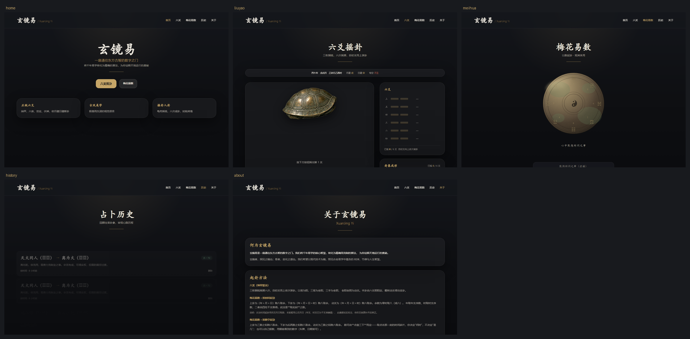
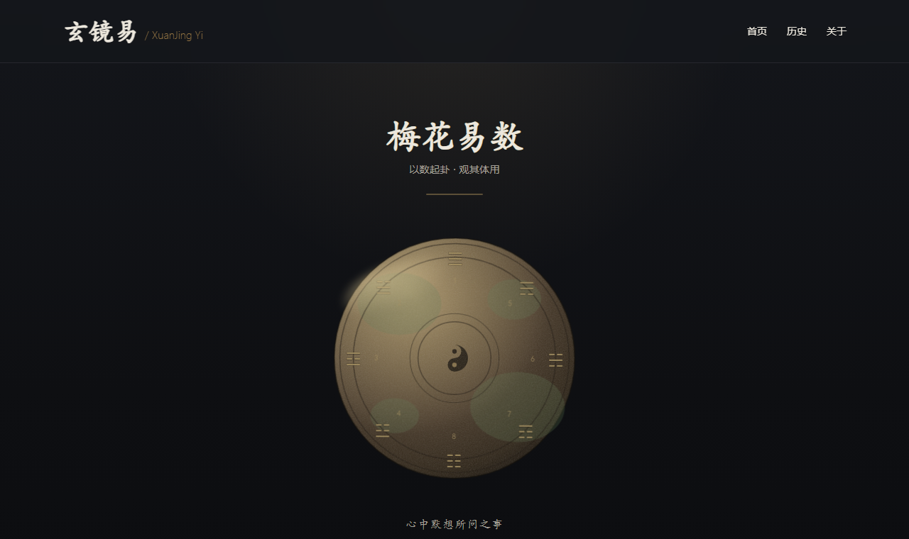

# 玄镜易 · XuanJing Yi

**把易学占断写成可复算的算法，而不是随机数生成器。**


六爻（纳甲筮法）与梅花易数两套完整的排盘、断卦引擎，配一套以青铜质感为主的古风界面：
龟壳摇钱成卦、八卦盘取数起卦，每一步判断都能追溯到经典依据。



---

## 这是什么

一个开源的易学文化数字化项目。它不满足于"随机出一个卦、再套一段模板文案"，而是把两套术数
的**规则**真正实现出来：

- 六爻：干支四柱、节气定月建、纳甲、六亲、世应、六神、伏神、旬空、进退、六冲六合，
  再到取用神与旺衰判定；
- 梅花易数：时间起卦与数字起卦、体用五行生克、动爻翻转变卦。

> **用途声明**：本项目为易学文化研究与算法演示而开发，排盘与断卦结果源自传统规则的
> 推演，仅供参考与学习，不构成任何现实决策建议，亦不提供商业占卜服务。

界面不是装饰，而是这些规则的**可视化**：为什么这一爻是"动爻"、为什么这卦是"体"，
在页面上都指得出来。

| 首页 | 六爻摇卦 |
| --- | --- |
|  |  |

| 梅花易数 · 静（待命） | 梅花易数 · 强（成卦） |
| --- | --- |
|  |  |

---

## 功能

### 六爻（纳甲筮法）

- **摇卦仪式**：龟壳震动、三枚铜钱飞旋后逐一落定，六轮成卦（可跳过动画直接起卦）
- **装卦**：本卦／变卦、宫位、世应、纳甲、六亲、六神、伏神、旬空
- **断卦**：按所问之事取用神（问感情时依性别分取妻财／官鬼），依月建日建判旺衰，
  逐条给出判断依据与权重，汇总为吉凶分档
- 六十四卦、八卦、四柱、节气均可单独查询

### 梅花易数

- **以时起卦**：取此刻之数（年支＋月＋日为上卦，再加时支为下卦），正统即"取当下"
- **以数起卦**：默认**点盘三下**，数取自点击那一刻；也可自己报数
- **成卦动效**：八卦盘上的上下卦亮起 → 六爻逐根浮现 → 动爻翻转 → 变卦剥离 → 体用分色与生克方向
- 界面刻意分两段节奏：起卦**静**（几乎不动），成卦那一下**强**（连续的动作）

### 历史与其它

- 起卦记录列表、展开详情、单条删除、**一键清空**
- 关于页记录起卦方法与解读的构成（含如实标注的偏差）
- **简繁语言切换**：页面右上角一键切换简体／繁体中文

---

## 技术栈

| 层 | 选型 |
| --- | --- |
| 后端 | Python 3.9+、Flask 2.3、SQLAlchemy 2.0、Flask-SQLAlchemy、Flask-CORS |
| 数据库 | SQLite（默认）／PostgreSQL（改 `DATABASE_URL` 即可） |
| 前端 | React 18、TypeScript 5.6、Vite 5、Tailwind CSS 3.4、Framer Motion 10 |
| 样式 | 纯 CSS 变量令牌 + Tailwind，**不依赖任何外网字体或 CDN，可完全离线运行** |

---

## 快速开始

需要 Python 3.9+ 与 Node.js 18+。

### 后端

```bash
cd backend
python -m venv venv
venv\Scripts\activate          # macOS / Linux: source venv/bin/activate
pip install -r requirements.txt
python run.py                  # http://localhost:5000
```

首次启动会自动建表（SQLite 文件落在 `backend/`）。

### 前端

```bash
cd frontend
npm install
npm run dev                    # http://localhost:3000
```

Vite 已配置 `/api` → `http://localhost:5000` 代理，前端无需额外配置。

---

## 自检

这是本项目最值得看的部分。

术数实现最容易犯的错不是"程序崩了"，而是**规则写错了但看起来一切正常**——卦还是出来了，
只是纳甲错了一位、世应反了、节气差了一天。所以这里不拿"没报错"当验证，而是用
**结果已知的传统卦例**去核对。

```bash
cd backend
py -c "from app.services.liuyao.selftest import main; raise SystemExit(main())"
```

当前：**1140 项检查，0 失败**。覆盖范围：

| 自检 | 验的是什么 |
| --- | --- |
| `ganzhi_selftest` | 干支推算与**节气精度**——与参考值逐项比对并打印偏差秒数，不隐藏误差 |
| `judgment_selftest` | 用神取法、旺衰判定、吉凶分档 |
| `api_selftest` | 用 Flask 测试客户端打**真实路由**（蓝图注册、参数校验、JSON 序列化都在范围内），数据库用内存 SQLite，不写盘 |
| `meihua_selftest` | 梅花易数起卦、体用生克、变卦，含已知答案的用例 |
| 统计检验 | 三枚铜钱须为三次独立投掷（二项分布 B(3, ½)）——检验的是**铜钱模型本身**，而不只是代码没报错 |

其中一条回归测试的由来值得一提：前端发的是带时区的 ISO 串（`toISOString()` 以 `Z` 结尾），
而引擎按 naive 当地时间处理，时间起卦曾因此直接抛异常。它此前没被发现，是因为**旧验证用手写的
无时区串绕过了这条路径**。现在两种形状都在测试里。

---

**分层约定**：`services/` 里的术数内核是**纯函数**，不依赖 Flask，可以单独调用与测试；
路由层只做参数校验、调内核、拼 JSON。所以自检能脱离 HTTP 直接验算理。

---

## API 一览

统一前缀 `/api/v1`。

**六爻**

| 方法 | 路径 | 说明 |
| --- | --- | --- |
| POST | `/liuyao/toss` | 摇一爻 |
| POST | `/liuyao/toss-six` | 一次摇出六爻 |
| POST | `/liuyao/paipan` | 装卦排盘并断卦 |
| GET | `/liuyao/topics` | 问事类别 |
| GET/POST | `/liuyao/sizhu` | 四柱干支 |
| GET | `/liuyao/hexagrams` | 六十四卦清单 |
| GET | `/liuyao/trigrams` | 八卦 |
| GET | `/liuyao/solar-terms` | 节气 |

**梅花易数与历史**

| 方法 | 路径 | 说明 |
| --- | --- | --- |
| POST | `/divination/query` | 起卦（时间／数字） |
| GET | `/divination/history` | 历史列表（分页） |
| GET | `/divination/history/<id>` | 单条详情 |
| DELETE | `/divination/history/<id>` | 删除单条 |
| DELETE | `/divination/history` | 清空全部（返回实际删除条数，幂等） |
| GET | `/hexagrams` | 卦象基础数据 |
| GET | `/health` | 健康检查 |

---

## 设计系统

配色与质感集中在一处：`frontend/src/index.css` 的令牌区块是**全站唯一色值来源**，
`tailwind.config.js` 只负责读取、组件只使用令牌类名，换配色不需要动组件。

- 令牌分两类：**通道三元组**（如 `--xj-gold: 198 165 103`）供 `rgb(var(--xj-gold) / <alpha-value>)`
  使用，因此 `bg-xuanjing-gold/20` 这类透明度修饰符可用；**完整色值**（如 `--xj-shell-deep: #17110A`）直接使用。
- 布局骨架由 `components/PageShell.tsx` 统一（内边距、内容宽度、竖向节奏、页头规格）。
- 按钮／卡片／输入框等原语集中在 `styles/ui.ts`，页面里不再内联 class 串——
  同一类控件此前有五种尺寸，翻页时按钮会轻微跳动。

青铜与铜钱的色值取自实物参考与截图采样，不是凭感觉调的。

---

## 已知边界与偏差

如实列出，避免误用：

- **时间起卦用公历月日**取数，古法用农历。年支、时支为干支准确值，此偏差在界面与 API 中均如实标注，
  待农历换算补齐后修正。
- **少数评分数值是工程设定的权重**，不是经典数据——它用于排序与分档，换一套权重数值就会变，
  而依据清单不变。六爻结果页与关于页均标注了这一点，**请以依据为准**。
- **无用户系统与鉴权**：`config.py` 中的 JWT 配置为预留，尚未接线，请勿直接暴露到公网。
- **Redis 缓存配置为预留**，未接线（未引入 Flask-Caching），当前所有计算都是实时完成的。
- **六爻的断卦结果尚未落库**：历史记录目前只保存梅花易数的起卦。
- **Docker 编排**：`docker-compose.yml` 与 `Dockerfile.backend`／`Dockerfile.frontend` 均已就绪，
  本机未安装 Docker 尚未实测容器构建，请以本地开发方式运行为准。
- **龟壳素材为 AI 生成图**：作者持有生成记录，但为避免 MIT 分发下的使用条款争议，将其列为待确认素材，
  组件内置矢量回退（删除素材文件即可自动切换），替换入口见 `docs/ASSET_SPEC.md`。

---

## Roadmap

- **农历换算**：时间起卦由公历月日取数修正为农历月日取数，修复「已知边界」中标注的偏差。
- **六爻断卦结果落库**：历史记录扩展为覆盖六爻完整排盘与断卦，与梅花易数对齐。
- **更多术数体系**：在六爻、梅花易数之外扩展更多传统术数的可复算实现。
- **多语言**：已提供简繁切换；后续按需扩展更多语言界面与释义。
- **社区建设**：以贡献指南（`docs/CONTRIBUTING.md`）为基础开放 issue 规范、示例卦例库与算法讨论。欢迎通过 GitHub 提交 issue / PR 参与。

---

## 文档

| 文件 | 内容 |
| --- | --- |
| [docs/ARCHITECTURE.md](docs/ARCHITECTURE.md) | 系统架构 |
| [docs/ALGORITHM.md](docs/ALGORITHM.md) | 算法说明 |
| [docs/DESIGN.md](docs/DESIGN.md) | 视觉与设计规范 |
| [docs/SETUP.md](docs/SETUP.md) | 环境与部署 |
| [docs/CONTRIBUTING.md](docs/CONTRIBUTING.md) | 参与开发 |
| [docs/ASSET_SPEC.md](docs/ASSET_SPEC.md) | 静态资源规格 |

> 注：这些文档写于项目早期，部分内容（模块划分、配色、Docker 步骤）尚未跟上当前代码，
> 以本 README 与代码为准，正在逐步校正。

---

## 许可

本项目以 [MIT License](LICENSE) 开源，可自由使用、修改与分发（含商用），仅需保留版权声明。

依赖均为宽松许可（Flask、React、Vite、Tailwind CSS、Framer Motion 等皆为 MIT/BSD 系），无 GPL 传染性。
